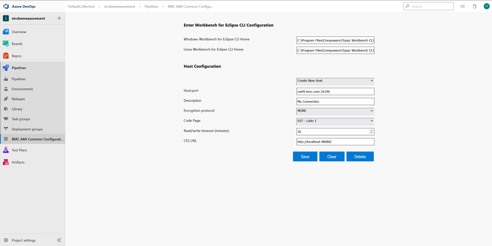

# BMC AMI Common Configuration

## Overview

The BMC AMI Common Configuration extension provides configuration settings that are shared by other BMC Azure extensions.

## Prerequisites

To use the extension you need Azure Pipelines - in Azure DevOps Services or Azure DevOps Server

## Installing extensions in Azure Pipelines - in Azure DevOps Services or Azure DevOps Server

Install the BMC AMI common configuration extension according to the Azure DevOps instructions for installing extensions.

### Configuring for Workbench for Eclipse CLI and Host Connections

To download Endevor, PDS, and Code Pipeline members you will need to point to an installed BMC AMI DevX Workbench for Eclipse Command Line Interface (CLI) that has host connections configured.

Navigate to Pipelines and go to BMC AMI Common Configuration section. Perform the following steps:

- **Windows Workbench for Eclipse CLI home** : Point to the Windows installation location of the CLI. If necessary, change the default values to match the correct installation location.

- **Linux Workbench for Eclipse CLI home** : Point to the Linux installation location of the CLI. If necessary, change the default values to match the correct installation location.

You must install the Workbench for Eclipse CLI on the machine that is configured to run the job.

**Host connections**

If no host connection appears in the Host:Port section, select Create New Host Option, and specify the required values the following fields:

- **Description** : Enter a description for the connection.

- **Host:Port** : Enter the z/OS host and port to connect to.

- **Encryption protocol** : Select the desired encryption protocol to be used for this connection. The encryption protocol is used to encrypt data sent to and from the host. The default value is \'None\'.

- **Code page** : Select the desired code page to be used for this connection. This is used to translate data sent to and from the host. The default value is 1047.

- **Read/write timeout (minutes)** : Enter the time in minutes for which the extension must wait to get a response from the host before timing out.

- **CES URL** : Optionally, enter a URL for BMC AMI Common Enterprise Services (CES). This URL is used by other BMC extensions that leverage REST APIs hosted by CES. For example, BMC AMI DevX Code Pipeline.

## Product Assistance

BMC provides assistance to customers with its documentation, the BMC Support Center website, and via telephone calls with the Customer Support team.

### BMC Support Central

You can access information about the BMC products via our Support site, [https://support.bmc.com](https://support.bmc.com/). Support Central provides access to critical information about your BMC products. You can review frequently asked questions, read or download documentation, access product fixes, or e-mail your questions or comments. The first time you access Support Central, you must register and obtain a password. The Registration is free.

### Contacting Customer Support

At BMC, we strive to make our products and documentation the best in the industry. Feedback from our customers helps us maintain our quality standards. If you need support services, please obtain the following information before calling BMC\'s 24-hour telephone support:

- The Azure pipeline job output that contains any error messages or pertinent information.

- The name, release number, and build number of your product. This information is displayed in the installed extensions page. Apply the filter, BMC to display all the installed BMC extension.

- Environment information, such as the operating system and release on which the Workbench for Eclipse CLI is installed.

You can contact BMC in one of the following ways:

#### Web:

You can report issues via the BMC Support website: [https://support.bmc.com](https://support.bmc.com/).

Note: Please report all high-priority issues by phone.

### Corporate Web Site:

To access the BMC website, go to [https://www.bmc.com/](https://www.bmc.com/). The BMC site provides a variety of product and support information.